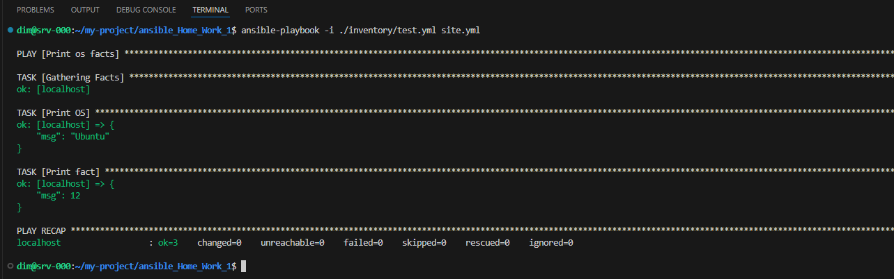
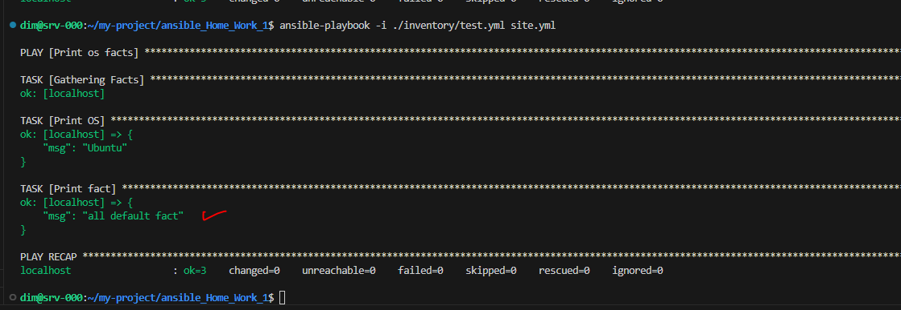
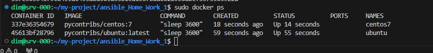
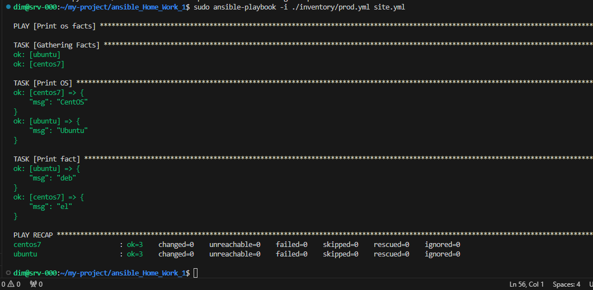
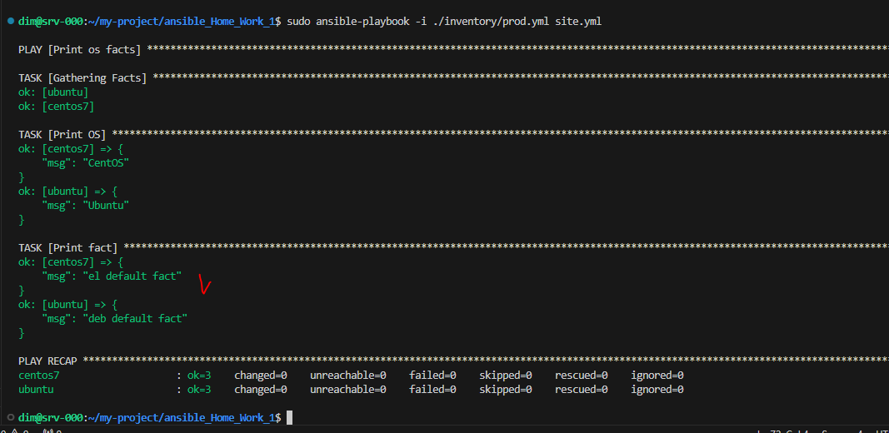
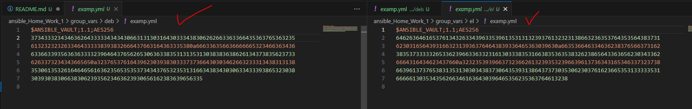
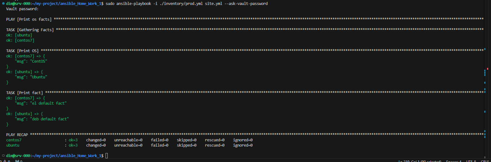
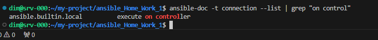
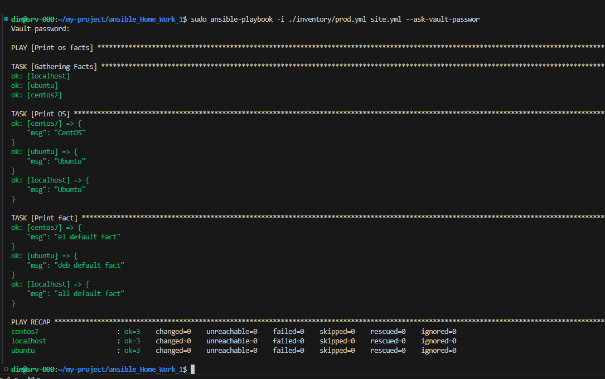

## Основная часть
1. Попробуйте запустить playbook на окружении из `test.yml`, зафиксируйте какое значение имеет факт `some_fact` для указанного хоста при выполнении playbook'a.
2. Найдите файл с переменными (group_vars) в котором задаётся найденное в первом пункте значение и поменяйте его на 'all default fact'.
3. Воспользуйтесь подготовленным (используется `docker`) или создайте собственное окружение для проведения дальнейших испытаний.
4. Проведите запуск playbook на окружении из `prod.yml`. Зафиксируйте полученные значения `some_fact` для каждого из `managed host`.
5. Добавьте факты в `group_vars` каждой из групп хостов так, чтобы для `some_fact` получились следующие значения: для `deb` - 'deb default fact', для `el` - 'el default fact'.
6.  Повторите запуск playbook на окружении `prod.yml`. Убедитесь, что выдаются корректные значения для всех хостов.
7. При помощи `ansible-vault` зашифруйте факты в `group_vars/deb` и `group_vars/el` с паролем `netology`.
8. Запустите playbook на окружении `prod.yml`. При запуске `ansible` должен запросить у вас пароль. Убедитесь в работоспособности.
9. Посмотрите при помощи `ansible-doc` список плагинов для подключения. Выберите подходящий для работы на `control node`.
10. В `prod.yml` добавьте новую группу хостов с именем  `local`, в ней разместите localhost с необходимым типом подключения.
11. Запустите playbook на окружении `prod.yml`. При запуске `ansible` должен запросить у вас пароль. Убедитесь что факты `some_fact` для каждого из хостов определены из верных `group_vars`.


## Решение 1


```bash
    $ ansible-playbook -i ./inventory/test.yml site.yml 
```




## Решение 2

```bash
    $ cat group_vars/all/examp.yml  #Вписываем значение 'all default fact' вместо "12"
```





## Решение 3

1 установил docker
2 запустил контейнеры

```bash
    $ sudo docker run --rm --name "ubuntu" -d pycontribs/ubuntu:latest sleep 3600

    $ sudo docker run --rm --name "centos7" -d pycontribs/centos:7 sleep 3600

    $ sudo docker ps
```



## Решение 4

```bash
    $ sudo ansible-playbook -i ./inventory/prod.yml site.yml 
```




"some_fact" для "managed host" "ubuntu" "deb".
"some_fact" для "managed host" "centos7" "el".

## Решение 5

```bash
   $ cat group_vars/deb/examp.yml # меняем some_fact: на "deb default fact"
   $ cat group_vars/el/examp.yml  # меняем some_fact: на "el default fact"
```
## Решение 6

```bash
    $ sudo ansible-playbook -i ./inventory/prod.yml site.yml 
```



## Решение 7

```bash
    $ ansible-vault encrypt group_vars/deb/examp.yml 
    $ ansible-vault encrypt group_vars/el/examp.yml 
```

после шифрования файлы выглядят так 



## Решение 8

```bash
    $ sudo ansible-playbook -i ./inventory/prod.yml site.yml --ask-vault-password
```




## Решение 9


```bash
    $ ansible-doc -t connection --list | grep "on control"
```




## Решение 10

меняем файл inventory/prod.yml 
добавляем в него 

```
    local:
    hosts:
      localhost:
        ansible_connection: local
```

## Решение 11

```bash
    $ sudo ansible-playbook -i ./inventory/prod.yml site.yml --ask-vault-passwor
```



собственно

 `some_fact` для `managed host` "ubuntu" `deb default fact`.
 `some_fact` для `managed host` "centos7" `el default fact`.
 `some_fact` для `managed host` "localhost" `all default fact`.
